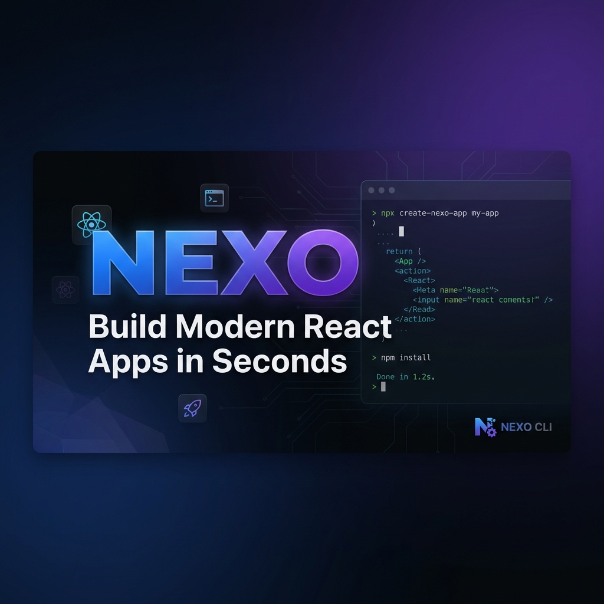

<p align="center">
  
</p>

<h1 align="center">NEXO CLI Website</h1>

<p align="center">
  <strong>🚀 The official website for NEXO — the ultimate React CLI scaffolding tool</strong>
</p>

<p align="center">
  <a href="https://www.npmjs.com/package/create-nexo">
    
  </a>
  <a href="https://github.com/Moshaban09/nexo-site/blob/main/LICENSE">
    
  </a>
  <a href="https://nexo-cli.dev">
    
  </a>
</p>

<p align="center">
  <a href="https://nexo-cli.dev">Website</a> •
  <a href="https://nexo-cli.dev/docs">Documentation</a> •
  <a href="https://www.npmjs.com/package/create-nexo">npm Package</a>
</p>

---

## ✨ About

This is the official website and documentation for **NEXO CLI** — a next-generation scaffolding CLI for modern React projects. Build production-ready apps in seconds with TypeScript, Tailwind CSS v4, and best practices baked in.

## 🛠 Tech Stack

| Technology | Version | Purpose |
|------------|---------|---------|
| ⚛️ React | 19 | UI Framework |
| ⚡ Vite | 7 | Build Tool |
| 📘 TypeScript | 5.9 | Type Safety |
| 🎨 Tailwind CSS | 4 | Styling |
| ✨ Framer Motion | 12 | Animations |
| 🧭 React Router | 7 | Routing |

## 🚀 Quick Start

### Install NEXO CLI

```bash
# npm
npm create nexo@latest

# pnpm
pnpm create nexo@latest

# yarn
yarn create nexo
```

### Run the Website Locally

```bash
# Clone the repo
git clone https://github.com/Moshaban09/nexo-site.git
cd nexo-site

# Install dependencies
npm install

# Start dev server
npm run dev

# Build for production
npm run build
```

## 📁 Project Structure

```
nexo-site/
├── public/              # Static assets
├── src/
│   ├── components/      # Reusable UI components
│   │   ├── ui/          # Base components (Button, Terminal)
│   │   ├── sections/    # Page sections (Hero, Features)
│   │   ├── docs/        # Documentation components
│   │   └── layout/      # Layout components
│   ├── pages/           # Route pages
│   │   └── docs/        # Documentation pages
│   ├── lib/             # Utilities & helpers
│   └── main.tsx         # Entry point
├── index.html           # HTML template
└── vite.config.ts       # Vite configuration
```

## 🔗 Links

- 📦 **NPM Package:** [create-nexo](https://www.npmjs.com/package/create-nexo)
- 🌐 **Website:** [nexo-cli.dev](https://nexo-cli.dev)
- 📖 **Documentation:** [nexo-cli.dev/docs](https://nexo-cli.dev/docs)
- 🐙 **CLI Repository:** [github.com/Moshaban09/create-nexo](https://github.com/Moshaban09/create-nexo)

## 📜 License

MIT © [Mohamed Shaban](https://github.com/Moshaban09)

---

<p align="center">
  Built with ❤️ using React + Vite + TypeScript
</p>
